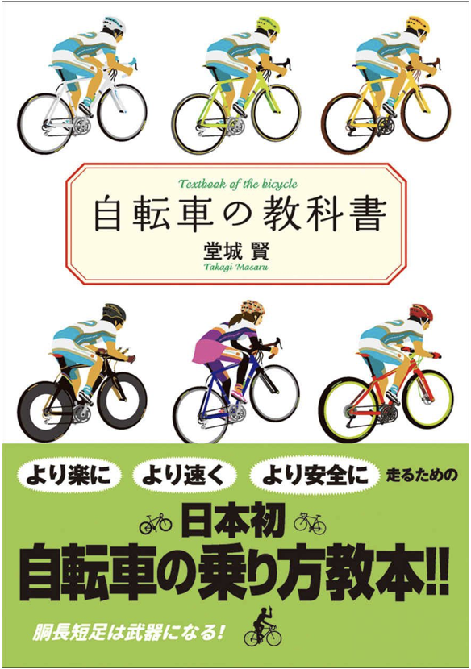
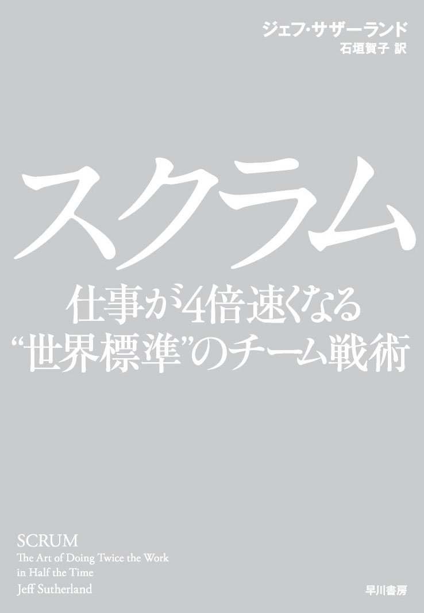
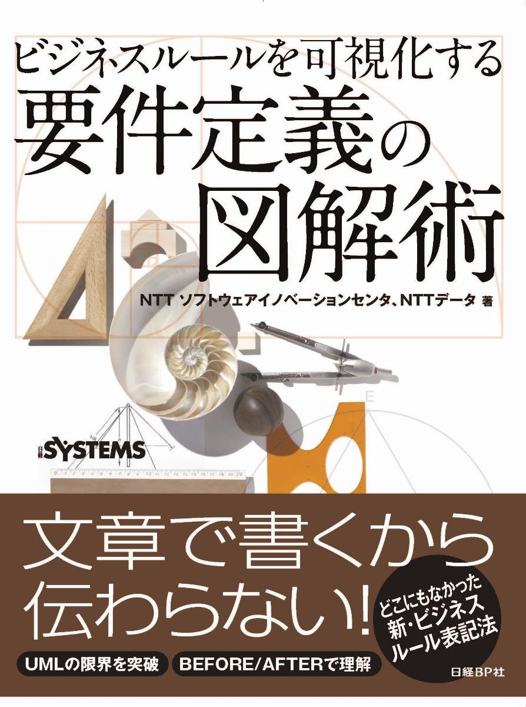

# 本に関する記録

<!-- @import "[TOC]" {cmd="toc" depthFrom=1 depthTo=6 orderedList=false} -->

<!-- code_chunk_output -->

- [本に関する記録](#本に関する記録)
- [購入記録](#購入記録)
  - [自転車の教科書 ー身体の使い方編ー (やまめの学校)](#自転車の教科書-ー身体の使い方編ー-やまめの学校)
    - [購入動機](#購入動機)
  - [自転車の教科書](#自転車の教科書)
  - [スクラム　仕事が４倍速くなる“世界標準”のチーム戦術](#スクラム-仕事が4倍速くなる世界標準のチーム戦術)
  - [ビジネスルールを可視化する 要件定義の図解術](#ビジネスルールを可視化する-要件定義の図解術)
  - [東大生のノートから学ぶ 天才の思考回路をコピーする方法](#東大生のノートから学ぶ-天才の思考回路をコピーする方法)
- [気になる本](#気になる本)

<!-- /code_chunk_output -->

# 購入記録

## 自転車の教科書 ー身体の使い方編ー (やまめの学校)

### 購入動機

おじぎ乗りを試したところ、すぐに変化を実感できたので、正しく身に付けようと考えたために購入。

## 自転車の教科書

## スクラム　仕事が４倍速くなる“世界標準”のチーム戦術
単行本（ソフトカバー） – 2015/6/24

## ビジネスルールを可視化する 要件定義の図解術
単行本 – 2015/12/18

## 東大生のノートから学ぶ 天才の思考回路をコピーする方法

# 気になる本